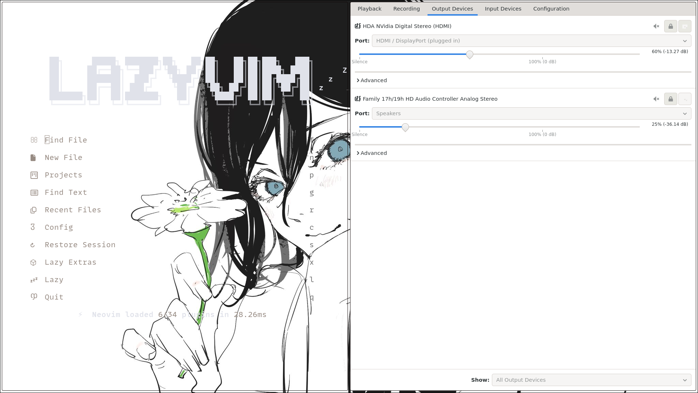
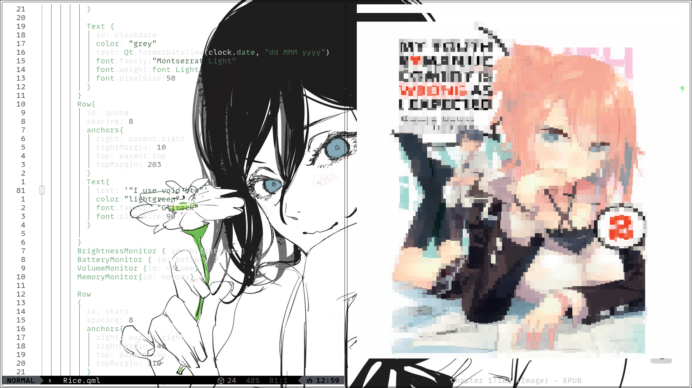

# Quickshell Linux Rice
## Screenshots







## Details

- **OS**: Void Linux
- **Shell**: Quickshell

## Installation

1. Clone this repository:
```bash
git clone https://github.com/Yujonpradhananga/quickshell-linux-rice.git
```

2. Copy the config to your quickshell directory:
```bash
cp -r quickshell-linux-rice/* ~/.config/quickshell/
```

3. Restart Quickshell or reload the configuration.

## Dependencies

- quickshell
- [Add any other dependencies here]

## Credits

Config by [Yujon Pradhananga](https://github.com/Yujonpradhananga)

---

Feel free to open issues or submit PRs!
